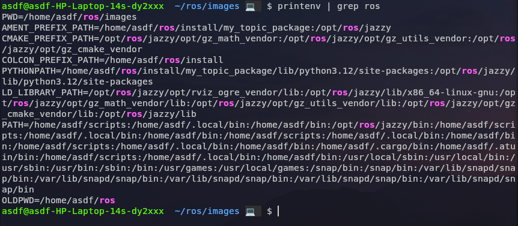
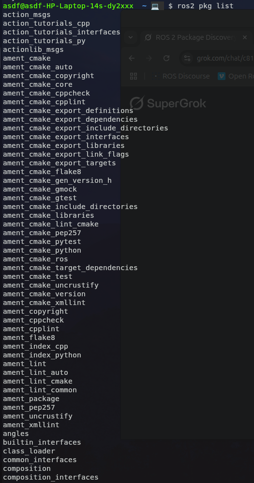

# ROS2 Repository

after the setup of the ros2 jazzy 

  1. create a ros_ws , and then create a src folder in it .
  2. then build ros workspoace using the command
        colcon build
        source install/setup.bash
        
   3. creating a ros package
                go inside the src folder
                ros2 pkg create --build-type ament_python package_name --dependencies rclpy std_msg
4. Edit created_package/setup.py to include the scripts as entry points
                when you create a package a setup.py and setup.cfg created .
                
5. command      1. ros2 pkg create --build-type ament_python package_name --dependencies rclpy std_msg
                2.colcon build

## packages in ros2 
				you can list them by 
                    ro2 pkg list

